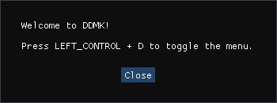

# DDMK NEVER CRY
This project came around after banging my head against a wall trying to get DDMK to install on the latest HD Collection update. At some point in 2024, either Capcom or the Steam Family Share update fucked the current version of DDMK for the retail version of the HD Collection. Luckily, I was able to piece together a solution for those also banging their heads against the wall trying to install DDMK. Hopefully now you’ll never have to cry again after this mod.

# DDMK
For more information on DDMK head over to the original repo [here](https://github.com/serpentiem/ddmk)  
To quickly see the complete feature set, See [Features](https://github.com/serpentiem/ddmk/wiki/Features) on the DDMK docs for a more detailed overview.

# Installation

Before anything if you have a save make sure to [create backups](#create-savegame-backups) in case this workaround breaks anything.

1. Download and install any and all of the pre reqs listed in this [video](https://www.youtube.com/watch?v=MAHKvElDCS8&lc=UgwY7iptsZnIIByvTYx4AaABAg)
    * [DirectX Redist (June 2010)](https://www.microsoft.com/en-us/download/details.aspx?id=8109)
    * [Visual C++ Redist 2015-2022 x86 and x64](https://learn.microsoft.com/en-us/cpp/windows/latest-supported-vc-redist?view=msvc-170)

> [!TIP]
> Confused? Check out this [video](https://www.youtube.com/watch?v=1LL8Hna3FIc&t=2s)  

2. Do a hard reboot on your system VCRedist should have prompted you to do this based on your windows install but if not go a head and do it anyways

3. Download and extract the [latest release]() `BASED ON YOUR GPUS ARCHITECHTURE` into the your DMCHDC Local Directory. By default this is `C:\Program Files (x86)\Steam\steamapps\common\Devil May Cry HD Collection`

You should be able to boot the game normally now from either Steam or the games exe directly.

If you've installed the mod successfully, you'll get a welcome message the next time you start the game (as in the actual game, not the launcher).

<!--  -->

## Whats The Difference Between 2.6 and 2.7.3

### 2.6 - Vanilla-esq 
This 2.6 is set up to have a vanilla playthorugh were weapons are acquired at the story beats   

When I first came across DDMK and tried installing it I found this [guide](https://youtu.be/MAHKvElDCS8?si=u2rRGhRX4Zic3E98), sadly it no longer worked with newer HD collection updates. However there was a link to a preconfigured directory of DDMK 2.6 Beta 2, which contained the downgraded .exe files along with specific tweaks to prevent crashes in certain mission segments. One of the segments in question is phase 2 of the Arkham fight durring mission 19 when Virgil joins. This happens because in order to make style switching workit requires the 'Single Actor' option in DDMK to be active which conflicts with Virgil's and the doppelganger's functionalities. To fix this, ProjectXsent included a script in the preconfig that skips this phase 2 in Mission 19 altogether
  

> [!NOTE]  
> This config has seemingly been tested according to comments in the oringal video and has worked for me past M10 (6-25-24). Will update this section with a proper playthrough

### Latest Build 2.7.3 - ALl Weapons Unlocked
This 2.7.3 has all weapons unlocked. Not sure if theres a work around just yet to match the 2.6 progression       

I applied the same logic and files I did when tinkering around with ProjectXsent 2.6 preconfig to get the game to boot by simply swapping out the the 2.6 beta 2 files with the latest 2.7.3 build

> [!IMPORTANT]  
> 2.7.3 of this config has not been tested on anything past M2 (6-25-24) the style switch works so I assume so do the guns and melee weapons do as well. Have not tested either Doppleganger or the M19 Phase 2 fight. Will update this section with a proper playthrough

### BB - Barebones
For anyone who wants to bring there version of DDMK over simply extract the files into your HD Collection install along side the BB-GPU.zip. This version doesnt contain anything other than the shimmed steam api and exes.  

> [!IMPORTANT]  
> Switch Style names are componets of UI mods. Such mods would have to be supplied to add visual aid durring gameplay.

# Differences Overview

| PACKAGES            | BB | 2.6 | 2.7.3 |
|---------------------|----|-----|-------|
| Text Fix            | ✅  | ✅   | ✅     |
| Downgraded EXEs     | ✅  | ✅   | ✅     |
| Vanilla Progression | ✅  | ✅   |       |
| DDMK                |    | ✅   | ✅     |
| Weapons Unlocked    |    |     | ✅     |
| Switch Port HUD     |    |     | ✅     |

## Whats Installed

| Archive                                                                                                                    | File                                                                     |
| ---                                                                                                                        | ---                                                                      |
| [DDMK](https://github.com/serpentiem/ddmk)                                                                                 | All Files                                                                |
| [xdelta3](https://www.romhacking.net/download/utilities/928/)                                                              | xdelta3-3.0.11-x86_64.exe                                                |
| [dmc3_quick_drive](https://github.com/serpentiem/ddmk/releases/download/2.7nightly16/dmc3_quick_drive.zip)                 | diff_pI000_00_3                                                          |
| [Switch HUD](https://github.com/serpentiem/ddmk/releases/download/2.7nightly16/dmc3_quick_drive.zip)                       | id100.pac                                                                |
| [Goldberg Emulator](https://gitlab.com/Mr_Goldberg/goldberg_emulator/-/jobs/4247811310/artifacts/download)                 | steam_api.dll, steam_api64.dll, steam_appid.txt, disable_networking.txt  |
| [Switch HUD](https://github.com/serpentiem/ddmk/releases/download/2.7nightly16/dmc3_quick_drive.zip)                       | id100.pac                                                                |
| [ProjectXsent 2.6 Pre Config](https://www.youtube.com/redirect?event=video_description&redir_token=QUFFLUhqbjM2ZWhMR2hXRWo5Qlg1QURmVGZybWtud2xFUXxBQ3Jtc0tuUm5mTGJDd0o0S2dGbWtYdHNybkxDV3ZsR1c5RHp2RkJUcGpMdi1OUlBvNXVKVTk0bGxiWnFkUFk2LXVtQ0YyMlVfLUhXbGk0RE5sVDN0bTNMdFhoUlp0clRYdldHQ01nOEtFa2IzM1NnQVBXMzBIRQ&q=https%3A%2F%2Fwww.dropbox.com%2Fs%2Ficvwpqch2om5t26%3Fdl%3D1&v=MAHKvElDCS8)                                             | dmc1.exe, dmc2.exe, dmc3.exe, dmcLauncher.exe                            |

# About Achievements
This workaround disables Steam Achievements as a by prodcut of the goldberg emulator

# Unknown Known Issues
During my time putting this together, I got a firewall popup asking me to allow private network access for each individual game. But for some reason, "Accept" was greyed out, but "Cancel" wasn't. Either way, canceling the popup didn't seem to break anything as the games opened and closed without fault after that, and no popup has happened since. I'm assuming this has to do with the Goldberg emulator. I've since included the disable networking config as per some people's suggestions, but there is no way for me to test this as I've already canceled the popup on my end  

# Create Savegame Backups

Go to the savegame directory. By default this is `C:\Program Files (x86)\Steam\userdata\STEAM_ACCOUNT_ID\631510\remote`. Should be the only folder in userdata unless you have multiple steam accounts

If you don't know your `STEAM_ACCOUNT_ID`, you can find it here:
* In Steam hover over your profile photo in the top right corner and click on `Account Details` you should then find the ID directly under your username

Copy the following files to a secure and easily accessible location:

* `dmc1.sav`
* `dmc2.sav`
* `dmc3.sav`

# Credits

Serpentiem and his work on [DDMK](https://github.com/serpentiem/ddmk)  
ProjectXsent and the [Pre Configuration](https://www.youtube.com/watch?v=MAHKvElDCS8&lc=UgwY7iptsZnIIByvTYx4AaABAg)  
